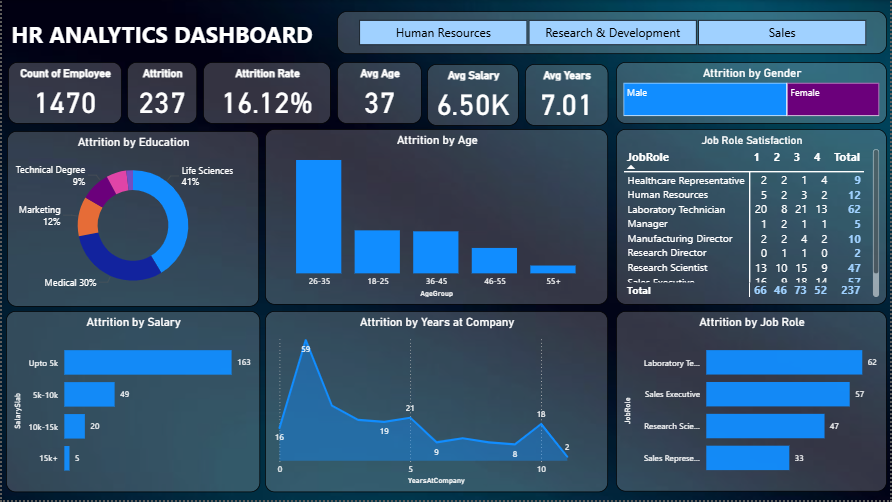

# HR Analytics Dashboard using PowerBI

Preview of the Dashboard:

## 📊 Project Overview
This project involves the development of an **HR Analytics Dashboard** using **Microsoft Power BI** to provide insights into employee retention and attrition trends within an organization. The dashboard visualizes critical HR metrics, enabling stakeholders to monitor the **number of present employees** and analyze the **factors influencing employee exits**.

## 🎯 Objective
The primary goal of this dashboard is to help HR teams and management:
- Track the number of current employees and those leaving the organization.
- Analyze trends and patterns associated with employee attrition.
- Gain actionable insights to develop effective retention strategies.

## 🔑 Key Features
- **Employee Headcount Analysis:** Overview of total active employees and attrition counts over time.
- **Attrition Trend Breakdown:** Interactive visuals showcasing attrition trends based on:
  - **Education Level**
  - **Age Group**
  - **Gender**
  - **Job Role/Department**
  - **Salary Range**
  - **Years at the Company (Tenure)**
- **Data-Driven Insights:** Identify key factors contributing to employee turnover.
- **Dynamic Filters & Slicers:** Enable users to drill down into specific categories for in-depth analysis.

## 🛠️ Tools & Technologies
- **Microsoft Power BI** (Data Visualization)
- **Microsoft Excel / CSV** (Data Source)
- **DAX Measures** (for KPIs and Calculations)
- **Power Query** (for Data Cleaning and Transformation)

## 🚀 Outcome
The HR Analytics Dashboard serves as a strategic tool for HR professionals to monitor workforce dynamics, understand attrition drivers, and support data-driven decision-making for improving employee retention and engagement.
